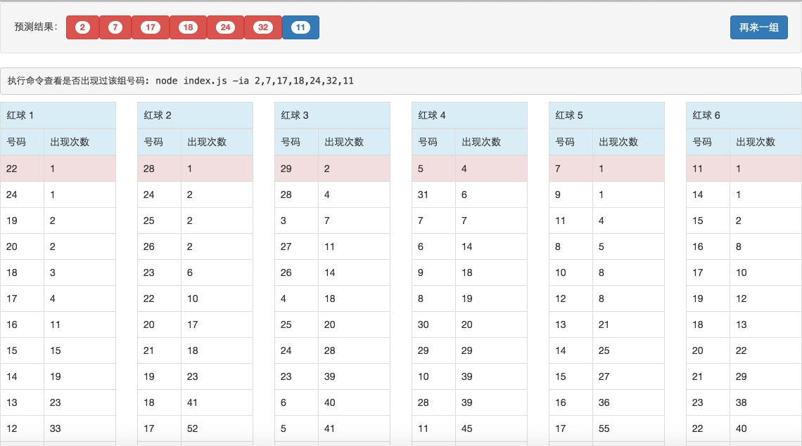

### 如何使用

0. npm run init

   首页项目初始化时需要执行，以后只需要从接下来的步骤开始即可

1. npm run start

2. 用浏览器直接打开index.html

   绿色：出现次数最多的号码

   红色：出现次数最少的号码

   黄色：最新开奖号码

### 更新数据
```
node index.js -ud
```
### 数据分析
```
node index.js -a
```
### 最新开奖号码
```
node index.js -cn
```
### 历史记录是否存在相同的开奖记录
```
node index.js -hdr
```
### 判断号码组是否已经开奖过
```
node index.js -ia groupNumber
```

### 数据展示

直接访问index.html


#### 选号的一些规则

测冷热号的原则是（以5期为准）(网上摘抄，未经验证)
1.5期以上没出的号码选3-6个
2.5期以内出现一次的选项3-6个
3.5期以内出现2次的选2-4个
5.5期以内出现3次的选0-2个